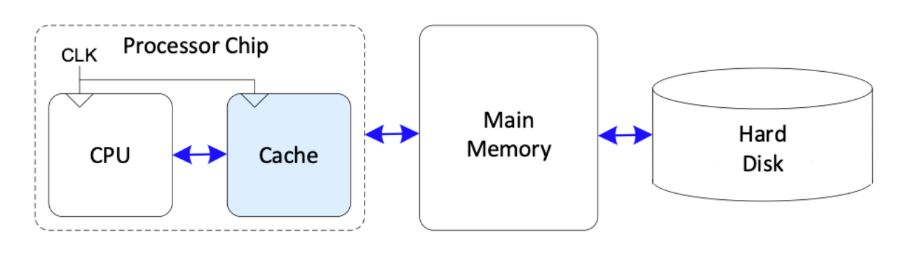

# Cache Version of the CPU
This version of the CPU contains the cache optimisation, specifically using the spacial-locality .

### What is Cache ?
Cache is known as the highest level in memory hierachy and is used to speed up processing by supplying the majority of the data. In this diagram:

We see that the cache is preferred over accessing data from either main memory or hard disk data. (Visually) It's nearer, but also we have to traverse over less hardware to access it.

## Design choice
To begin with there are direct-mapped and fully associative caches. Direct-mapped caches offer great speed and simple hardware.(Since each data memroy address is linked to one cache set.), but they have a higher chance of misses and data being evicted. Conversely, fully associative caches have zero conflict misses, but are expensive to have as we must do extensive checks on the data validity.

As a compromise, I will design a 2-way set associative cache, where instead of going directly into 1 slot, memory can now go into two different slots in any given set, allowing us to check two tags in parallel. This greatly reduces conflict misses compared to direct-mapped cache while having a lower hardware cost compared to the fully associative cache.

## Replacement Policy 
By its nature, a cache cannot hold all the data we need in a program at once (Otherwise it would just become a main memory lol). So, when the cache is full, and a new data block is stored, we need to evict an existing data block. Of course, there will come a time where we need to access the evicted data block. Which we need to fill another slot and evict another data block. Obviously each instance of this process - or 'miss', because we are missing the data in the cache, takes longer to do than just referencing the cache data, so we need to evict the right data block that has the lowest chance of being needed again.   

To solve this, we use the Least Recently Used(LRU) replacement, basically we keep track of which block has been used the least and evict it.

## Write policy for cache memory
When writing to a cache block, we need to make sure to modify the actual memory itself, other we enter a cache coherency issue, where the values do not match. To solve this I used the write-back cache solution, where I use a bit to indicate if a cache block is modified or 'Dirty'. When the cache block is evicted, it will only then update the memory. This saves time as we don't need to constantly update the memory.

## Multilevel Cache
For this CPU, I hope to implement a three level cache system

## Implementation 
### Parameters, Inputs & Outputs
For each cache, we need the following parameters:
- Data Width - stand unit of length across the CPU on how big the data is
- Bits for the number of sets - This tells us which the instruction is referring to
- Tag Width - The tag is used to verify that this is the correct data block we are looking for, and takes up most of the data length

For inputs, we need our `clk` and `rst` inputs, as well as:
1. Load & Store Flags - Instruction flags to tell what instructions they are
2. Address - This is where we infer the cache address of the data
3. Data - The data we want to write to the cache block
4. MemData - Data from memory we may want to load into a block
5. MemReady flag - to indicate that whatever operations were going on in the Cache is complete

For outputs, we have:
1. Hit & Miss flags - basically is the data exists or doesn't in the cache
2. MemWrite - Write data to memory
3. MemRead Flag - To pull data from memory (Or lower cache) because the data does not exist in this cache
4. Busy - indicates that the CPU is handling a miss case
5. Dataout -The data returned from the cache to the CPU
6. MemData - This is any evicted data that has to be written back to the memory file. We basically rewrite over the memory whenever it is evicted