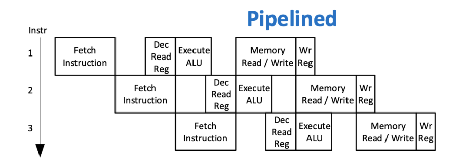
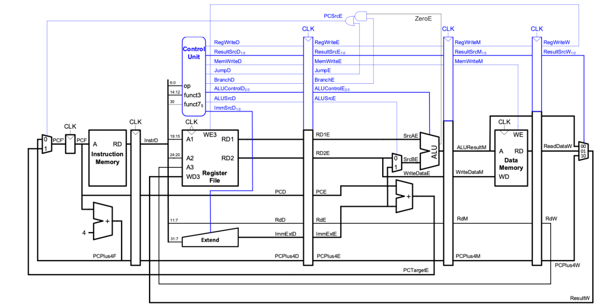
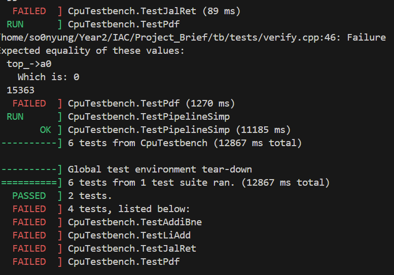
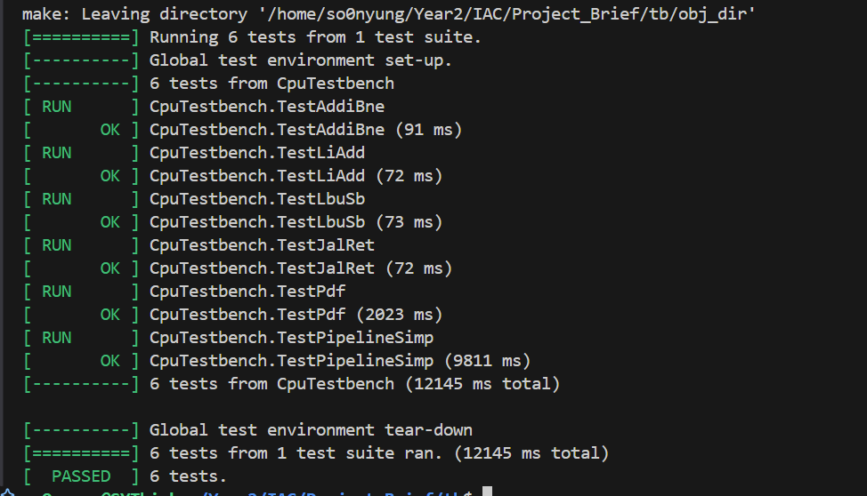

# Pipelined Version
This README.md details what design choices I made to create a pipelined version of my RISC-V CPU and the theory behind it (hopefully)

## Theory (Why pipeline be pipelining)
When reading a CPU, we always go through the following steps for EACH instruction:
1. Fetch Instruction
2. Decode Instruction
3. Execute ALU
4. Read/Write Memory
5. Write to Register


In our Single-Cycle version, we complete every instruction first before moving to the next. This is the safest option, because it means we can account for all cases- branch, jump etc. without the worry for it not computing properly (If it does, it's the design of the CPU that is at fault). In a diagram, two instructions would look like this:


In the Pipelined vesion, we aim to speed up the computation by **starting the second instruction's computation cycles whilst the first instruction is running**. In a diagram it looks like this:


## Implementation - Simple
So, the question, how do we implement this ? Basing of this image:


We can see a few things:
1. The individual components we have now can be left as is :)
2. We need to modify all the top files: `top.sv`, `CREtop.sv`, `ADPtop.sv`, `PCItop.sv`.
3. I'll be splitting the CPU into five sectins. On the system verilog implementation, it will look like this:
```
module TOP(
    //Inputs + outputs
);

//Internal Wires
IF(
    // inputs
);
ID(

);

EX(

);

MEM(

);

WB(

);
endmodule
```

### Pipelined Registers
To make the pipelined registers, we make 4 main 'register' file modules:
1. IF/ID
2. ID/EX
3. EX/MEM
4. MEM/WB
5. WB/IF

At the moment, we ignore hazards first, and just put it as a simple clock circuit (At the positive edge of the clk, we assign the output to the input)

This pretty much applies to all the registers.

### New top levels
With these registers, we can now split our new top into five tops, splitting our old modules into new ones, splitting them as such:
1. `IFtop.sv` - Instruction memory, multiplexors, Plus4 module, basically the new PC Counter
2. `IDtop.sv` - Control Unit, Register Unit, Extension Unit, we need to modify the control unit to add the JumpD, BranchD, and ResultSrcD
3. `EXtop.sv` - ALU Unit, Immediate Operation 
4. `MEMtop.sv` - Data memory
5. `WBtop.sv` - Multiplexor to modify the Result
6. `top.sv` - we connect all the previous top units together

In `IDtop.sv`, we need to modify our Control Unit, to produce a `Branch` signal. The question is... how ??
Referencing the ISA, we see that the opcode for Branch Instructions are consistent: 1100011 (99), so we can simply just add a logic wire `Branch`, and set it based on the instruction.

### Testing

To test this, I basically just had several tests with a bunch of instructions with NOPs. I left the original instructions to show that it is indeed not possible to detect hazards yet. 



As we can see, the branch and load tests without NOPS were not able to pass, that's where our hazard unit comes in.

Currently, we will face two hazards:
1. Data hazards - Where the Register value is not yet written back to the register files
2. Control + Load hazards - the next instruction is not decided yet, typically for branch & Jump instructions

## Implementation - Hazard Unit
The hazard unit is kind of like a Control Unit, but instead of dictating what operations to do, we instead allocate **Stalls** and **Flushes**. Stalls simply pause a certain section in place, whereas Flushes 'wipe' the section clean, introducing a NOP.

In addition, it can also forward values not yet written to the data memory if needed. The theory of this is because we are executing multiple instructions simultaneously, we would have value needed somewhere within the internal busses. The key is knowing where and when to forward them.

### Forwarding Data
Forwarding Data is the simplest of the hazard corrections to implement. To begin, we add some some additional outputs from the Decode Stage - Rs1D, Rs2D:
```
assign Rs1D = InstrD[19:15]; -> Register 1
assign Rs2D = InstrD[24:20];-> Register 2
```
These are the register used in different instructions. The goal is to move these along the 5 stages, and compare the inputs at different stages in the hazard unit. If they match, we know that we will need to push the data forward, ahead of it being written to memory. From the execute stage, we only have the Memory and Writeback stage, which means we must check if the register files are matching. Because the memory stage contains the most recent instruction, we prioritise it's checking.

```
// SAMPLE CHECKING MECHANISM
        if (RegWriteM && (RdM != 5'b0) && (RdM == Rs1E)) begin
            ForwardAE = 2'b10;  // Forward from MEM stage (ALUResultM)
        end else if (RegWriteW && (RdW != 5'b0) && (RdW == Rs1E) && 
                     !(RegWriteM && (RdM != 5'b0) && (RdM == Rs1E))) begin
            ForwardAE = 2'b01;  // Forward from WB stage (ResultW)
        end
```
From here, the hazard unit outputs 2-bit variables - `ForwardAE` and `ForwardBE`. To finalise the forwarding mechanism, we need to add muxes in the Execute stage which can use these outputs to select the correct data - Either the current selected registe value, the ALUResult of the previous instruction, or the reuslt of an instruction in the Writeback stage.
```
// SAMPLE MUX In the Execute Stage
RD1mux #(
    .DATA_WIDTH(DATA_WIDTH)
) Rd1mux (
    .ForwardAE(ForwardAE),
    .RD1E(RD1E),
    .ResultW(ResultW),
    .ALUResultM(ALUResultM),
    //output
    .SrcAE(Int_SrcAE)
);
```
(Because of it's simplicity, there's a version of the [pipeline with just the forwarding mechanism](./SimplePipeline/). You'll notice it's so simple that I had placed it under the `Extop.sv` file, because it only affected the Execute stage. This would change in future iterations.)

### Stalling
Stalling is used when an instruction in the decode stage depends on the result of a load instruction in the execute stage. A load’s data isn’t available until after the memory stage, so forwarding can’t solve this hazard.

To solve this, we create a flag in the Execute stage `MemReadE` - indicating that the instruction is a load instruction:
```
always_comb begin
    MemReadE = (ResultSrcE == 2'b01);
end
```
From there, in the hazard unit we check if a destination register (`RdE`) of the instruction in Execution exists (RdE = 5'b0 means there's no destination register). If so, we check if `RdE` matches the registers needed in the decode stage. From there, it controls a flag to signal that a Load-Use hazard exists.
```
if (MemReadE && (RdE != 5'b0)) begin
            // Check if the instruction in decode stage needs the load result
            if (((RdE == Rs1D) && (Rs1D != 5'b0)) || 
                ((RdE == Rs2D) && (Rs2D != 5'b0))) begin
                LoadUseHazard = 1'b1;
            end
        end
```

If indeed a Load-Use hazard exists, we will: 1) Prevent a new instruction from being fetched, 2) Keep the current instruction being decoded in place.

```
if (LoadUseHazard) begin
            StallF = 1'b1;  // Prevent new instruction fetch
            StallD = 1'b1;  // Keep current decode instruction frozen
end
```
These are used in the `IFtop.sv` and `IFIDReg.sv` files. The premise in both is the same. If the Stall flag is not up, we undergo normal sequential update:
```
always_ff(@posedge clk) begin
    if(!Stall) begin
        Sample_Output <= Sample_Input;
    end
end
```

### Flushes
Flushes clear pipeline stages to prevent wrong instructions from executing. They are split into two cases: Control Hazards & Load-use hazards
#### Control Hazards 
Control Hazards typically occur when we are doing branches or jumps instruction - There may be instructions loaded in that will alter the end result. So we have to flush these instructions of the CPU, ie convert them into NOPs.

This CPU first detects hazards by utilising the established `PCSrcE` flag. We need this flag to tell the Fetch stage whether to use the next sequential instruction, or use the calculated instruction to go to. Effectively, it's telling us if a branch or jump is taking place.

However, we need to clarify further if this is a jump, or branch. And if it is a branch, **has the branch taken place yet ?** To detect if it's a jump is simple. The Control Unit produces a Jump flag which we can reuse. 

For the branch, it's a little trickier. Because there are conditions to branches, we need to take the inputs from the execute stage and ensure that the results correspond to the correct function. We then need to compare it to the branch flag. If these two match, a branch has occured. 

Finally, if either a jump or branch has occured, the `PCSrcE` flag goes up.
```
logic BranchCon;
always_comb begin
    case(funct3E)
        3'b000: BranchCon = Int_ZeroE;        // BEQ: branch if equal (Zero=1)
        3'b001: BranchCon = ~Int_ZeroE;       // BNE: branch if not equal (Zero=0)
        3'b100: BranchCon = ALUResultE[0];    // BLT: branch if less than
        3'b101: BranchCon = ~ALUResultE[0];   // BGE: branch if greater/equal
        3'b110: BranchCon = ALUResultE[0];    // BLTU: branch if less than unsigned
        3'b111: BranchCon = ~ALUResultE[0];   // BGEU: branch if greater/equal unsigned
        default: BranchCon = 1'b0;
    endcase
    
    PCSrcE = JumpE | (BranchE & BranchCon); // Change if it's either a jump or branch
end
```

On the hazard unit's end, as long as the `PCSrcE` flag is up, it will detect a control hazard. From there, the flush flags for the Decode and Execute stage will go up. These go to the `IFIDReg.sv` and `IDEXReg.sv` respectively

Both do the same thing, where they will reset the instructions, flags, whatever signals are in there, will be turned to 0 - rendering a NOP.

#### Load-Use hazards
Beyond just stalling, the load-use hazards require the instruction after the load instruction, entering the Execute stage to be flushed. This is so no errors are made. Similar to the control hazard, it effectively introduces a NOP in the `IDEXReg.sv` by triggering the `FlushE` flag

### Modifying Register File
The final change was pretty unexpected, which is to modify the Register file to update its value on the negative rather than positive edge. In testing over 3 days, I realised that despite a complete hazard unit, the register outputs were still 1 cycle behind, and the CPU just reads the wrong value. 

Why does this happen ? Because my pipeline is postive-edge triggered, the register file reads and writes on the same clock edge. Usually, this is fine. But in some cases like a load instruction, the value is written to the destination register at the end of the clock cycle. At the same time, a dependent instruction might read the register value at the start of the cycle, which hasn't been updated. By writing the values on the negative edge, we ensure the register value is written before it is read.


## Testing
In addition to the tests given, I created some other assembly test files which shld ensure that the hazard detection in the pipeline can take place multiple times. In the end, I removed the NOPs between the instructions, and tested the circuit, which gave the following result:



