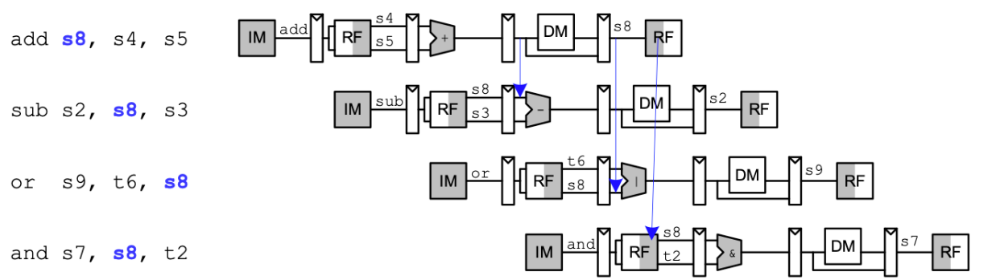
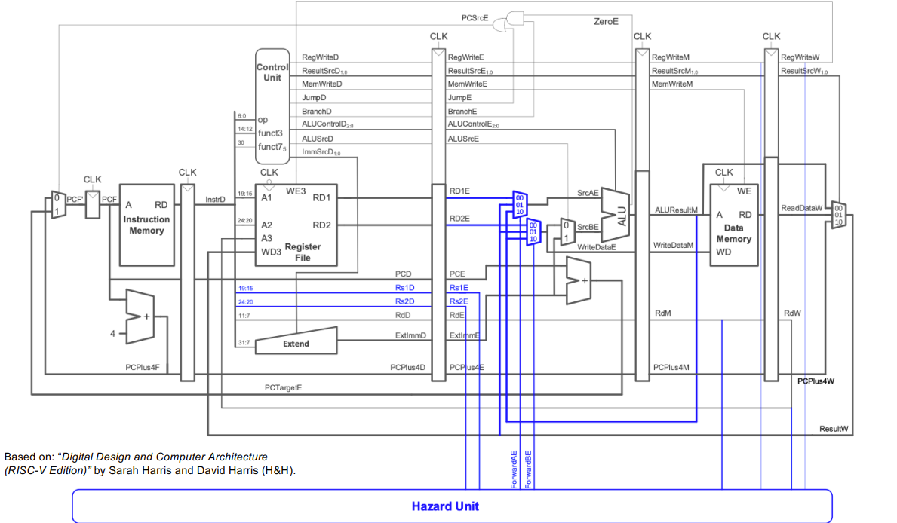

# Pipelined Version
This README.md details what design choices I made to create a pipelined version of my RISC-V CPU and the theory behind it (hopefully)

## Theory (Why pipeline be pipelining)
When reading a CPU, we always go through the following steps for EACH instruction:
1. Fetch Instruction
2. Decode Instruction
3. Execute ALU
4. Read/Write Memory
5. Write to Register


In our Single-Cycle version, we complete every instruction first before moving to the next. This is the safest option, because it means we can account for all cases- branch, jump etc. without the worry for it not computing properly (If it does, it's the CPU's fault). In a diagram, two instructions would look like this:


In the Pipelined vesion, we aim to speed up the computation by **starting the second instruction's computation cycles whilst the first instruction is running**. In a diagram it looks like this:


## Implementation - Simple
So, the question, how do we implement this ? If I gave myself this diagram:


I would cry, because how even do you implement this ? However, it does tell a few things:
1. The individual components we have now can be left as is :)
2. We need to modify all the top files: `top.sv`, `CREtop.sv`, `ADPtop.sv`, `PCItop.sv`.
3. I'll be splitting the CPU into five sectins. On the system verilog implementation, it will look like this:
```
module TOP(
    //Inputs + outputs
);

//Internal Wires
IF(
    // inputs
);
ID(

);

EX(

);

MEM(

);

WB(

);
endmodule
```

### Pipelined Registers
To make the pipelined registers, we make 4 main 'register' file modules:
1. IF/ID
2. ID/EX
3. EX/MEM
4. MEM/WB
5. WB/IF

At the moment, we ignore hazards first, and just put it as a simple clock circuit (At the positive edge of the clk, we assign the output to the input)

This pretty much applies to all the registers.

### New top levels
With these registers, we can now split our new top into five tops, splitting our old modules into new ones:
`IFtop.sv`, `IDtop.sv`, `EXtop.sv`, `MEMtop.sv`, `WBtop.sv`, and finally `top.sv`

We split the modules as such:
1. `IFtop.sv` - Instruction memory, multiplexors, Plus4 module, basically the new PC Counter
2. `IDtop.sv` - Control Unit, Register Unit, Extension Unit, we need to modify the control unit to add the JumpD, BranchD, and ResultSrcD
3. `EXtop.sv` - ALU Unit, Immediate Operation 
4. `MEMtop.sv` - Data memory
5. `WBtop.sv` - Multiplexor to modify the Result
6. `top.sv` - we connect all the previous top units together

In `IDtop.sv`, we need to modify our Control Unit, to produce a `Branch` signal. The question is... how ??
Referencing the ISA, we see that the opcode for Branch Instructions are consistent: 1100011 (99), so we can simply just add a logic wire `Branch`, and set it based on the instruction.

[There's been a long jump, but basically I was remaking the modules]

### Testing

To test this, I basically just had several tests with a bunch of instructions with NOPs. I left the original instructions to show that it is indeed not possible to detect hazards yet. 


As we can see, the branch and load tests without NOPS were not able to pass, that's where our hazard unit comes in.

Currently, we will face two hazards:
1. Data hazards - Where the Register value is not yet written back to the register files
2. Control hazards - the next instruction is not decided yet, typically for branch instructions

## Implementation - Hazard Unit

### Solution for Data Hazards
To solve data hazards, we handle them by forwarding data values internally. The theory is that by the time the next instruction is made, we would already have the value 'somewhere' in the internal busses. 

So, we check that the source register in the execute stage matches the destination register of the instruction in Memory or Writeback stage, and forward the result if it matches.



Thus, we can reference this image for how to design the hazard unit:

And start to build at least a basic hazard unit, which just has the flushing function, which is really simple;
```
always_comb begin
        ForwardAE = 2'b00; // Assume 
        ForwardBE = 2'b00;
    //RD1E
        if (RegWriteM && (RdM != '0) && (RdM == Rs1E)) begin
            ForwardAE = 2'b01;  // from MEM (EX/MEM)
        end else if (RegWriteW && (RdW != '0) && (RdW == Rs1E)) begin
            ForwardAE = 2'b10;  // from WB (MEM/WB)
        end

    //RD2E
        if (RegWriteM && (RdM != '0) && (RdM == Rs2E)) begin
            ForwardBE = 2'b01;  // from MEM (EX/MEM)
        end else if (RegWriteW && (RdW != '0) && (RdW == Rs2E)) begin
            ForwardBE = 2'b10;  // from WB (MEM/WB)
        end


    end
```
In addition to this, we need to add two muxes to select the values

### Solution for Control Hazards
