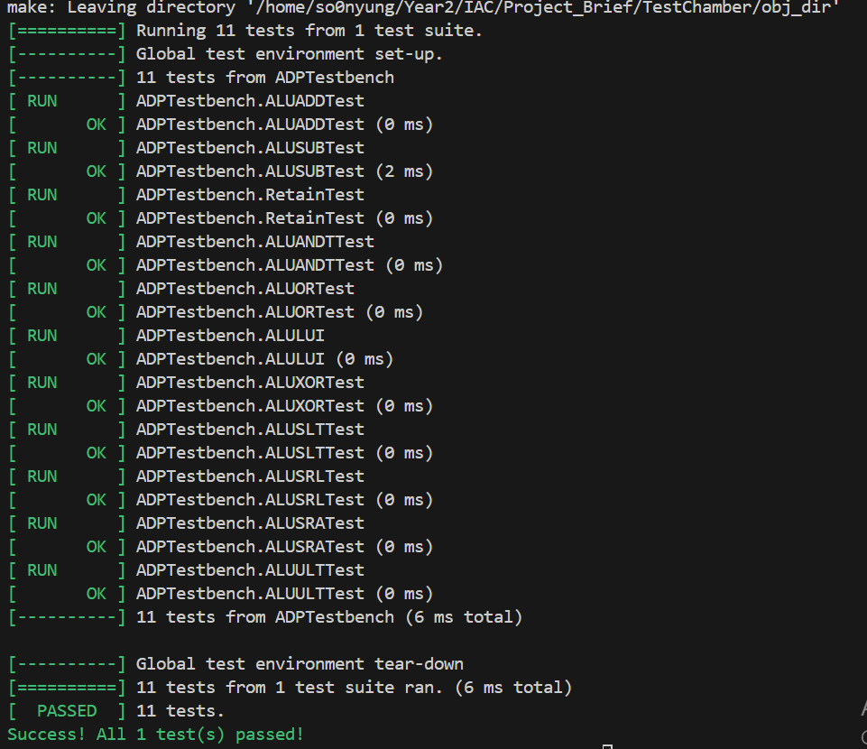
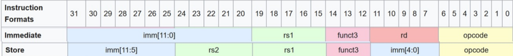
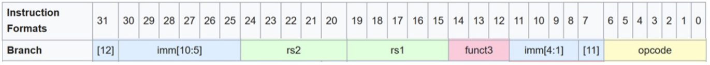
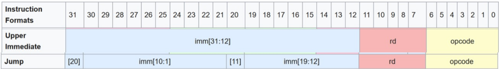
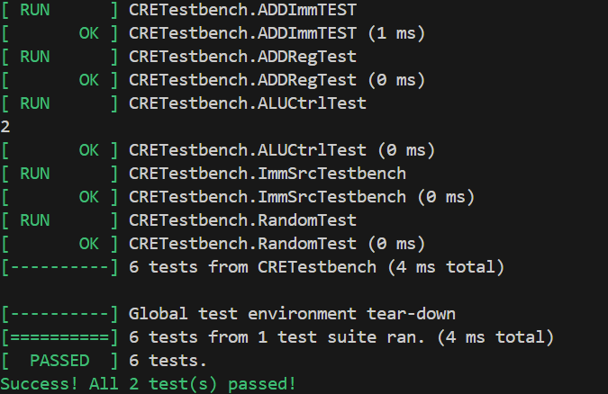

# Single Cycle RISC-V CPU
This is the single-cycle RISC-V CPU that I designed. It is the first of the designs that I made and serves as the basis for the pipelined and cache designs. This is the most detailed in that it talks about the initial designs and the fundamental choices I made. (In some ways, pipelining and caching should not affect the opcode and the control unit functionality, only the speed)

## Splitting of Modules
With the given modules, the base CPU architecture can be split into three sections again:


1. PC Selection + Instruction Memory - This will determine the instruction address and the instruction number sent out
2. Control Unit, Register files and the Extension Unit - This is where we sign the instructions and various inputs to the ALU unit
3. ALU, Data Memory and PCTarget - This calculates any calculations needed and outputs them to the register files or PC selection.


## ALU, Data Memory and PCTarget (ADP)
 
There's three units involved in this unit:
1. The ALU unit - which does all the calculations needed.
2. Data memory - this aids in `lw` and `sw` instructions
3. PCTarget - This adds the sign immediate to the current PC address to indicate the next instruction.

### ALU
For the ALU, there are several inputs and outputs:

#### ========== Inputs ==========
1. SrcA and SrcB - Arithmatic values
2. ALUControl - A 3 bit line of code that dictates the type of the ALU operation done.

#### ========== Outputs =========
1. Zero - The bit that represents if the resultant operation leads to a zero, useful for `beq` and `bne` instructions
2. ALUResult - The 32-bit result

From there, we can now begin to construct the ALU.
#### Instructions
Because of a lot of instructions require the functionality multiple modules together (duh... otherwise what's the point ??), we focus less on instructions, and more on the specific things we require from the module.

For the ALU, most of the computations are done here, and it depends heavily on what the given opcode is. As a general basis, we require:
1. ADD, SUB (This can be used for register + register and register + immediate, signed and unsigned)
2. MUL
3. Shifting instructions (This is done with arithmatic shift, logic shift)
4. Loading immediate values

Hopefully with 3 bits it's enough (We have 8 slots to fill)
- We did not lol, I used 4 bits for now

But I realised the code with the ALU unit does not actually matter.
Why ? Because it's produced by the control unit, which should be the one to generate the `ALUControl` bits, so really, I can put it however I want, I just need to modify my control unit lol (Would've saved me some time but oh well...)


### Data Memory
For the Data Memory, we have several inputs:
1. WE - A Write Enable to allow date to be written 
2. A - Address spot provided by the ALU, which can be used to write or Read
3. CLK - clk cycle
4. WD - Write Data - The data we want to write to
5. RD - Read Data - Data Read.

And one output:
- ReadData - The Data read

This leads to the question - If there is always an output, how do we differentiate between if the data is written or read ? Well, we add an additional multiplexor:
```
module ADPMux #(
    parameter DATA_WIDTH = 32
)(
    input logic     ResultSrc;
    input logic [DATA_WIDTH -1 :0]    ALUResult;
    input logic [DATA_WIDTH -1 :0]   ReadData;
    output logic [DATA_WIDTH -1 :0]   Result;
);

assign Result = (ResultSrc) ? ReadData : ALUResult;

endmodule

```
### PCTarget
The final component is the PCTarget module. Honestly it's not that big a deal. I'm adding it now for just seperating the component. I'll probably just integrate it into another unit later. The unit is literally:
```
module PCTarget #(
    parameter DATA_WIDTH = 32
)(
    input logic [DATA_WIDTH -1 :0] PC,
    input logic [DATA_WIDTH -1 :0] ImmExt,
    output logic [DATA_WIDTH -1 :0] PCTarget
);
assign PCTarget = PC + ImmExt;

endmodule

```
So like... literally might add it to the top level unit because it's really simple. Ah whatever, it simplifies it for now.

### All Together now
Having done all the modules, we can now make a top layer to test these modules, `ADPtop.sv`. For now, we simulate inputs from the Control Unit and other units:
1. ALUControl
2. MemWrite
3. ResultSrc
4. SrcA
5. SrcB
6. WriteData
7. clk
8. PC
9. ImmExt
10. ResultSrc

With three outputs:
1. Zero - bit to symbolise the result is 0
2. Result
3. PCTarget

Then I made a google test .cpp script, which works :)
Had to amend some of the test files for syntax errors, but all is good now.


## Control Unit, Register Files and Extension Unit (CRE)
The CRE section has three main components and a small multiplexor:
1. Control Unit
2. Register File
3. Extension Unit

### Register File
The Register file has the following inputs:
1. A1 - Address number 1
2. A2
3. A3 - Address file for wriitng data
4. WD3 - W
5. WE - Write Enable
6. clk - Clock, it does as advertised

And the following outputs:
1. RD1 - Data from the first address
2. RD2 - Data from the second address

The register file is pretty similar to previous designs from the Lab4, so I repurposed it for now, removing the a0 output.

### Extension Unit
The extension unit takes the [31:7] bits of the instruction and returns the different values based on the different instructions in the `ImmSrc`. It then outputs an `ImmExt` value.

We need to account for four types of immediates:
1. I-type immediates: `addi`, `lw`, `jalr`
2. S-type immediates: `sw`, `sb`
3. B-type immediates: `beq`, `bne`
4. J-type immediates: `jal`
5. U-type immediates: `lui`, `auipc`

The goal is based on the tables of the RISC-V Archiecture, we can map out how the immediates are constructed from each type of instruction.

For the I and S-type immediates, they are stored as such:


The B-type immediates have this structure:


And the U and J-type immediates have these structures:



From these, we are able to derive the following formats for each type:

```
// I-type Immediate
ImmExt = {{20{ImmInput[31]}}, ImmInput[31:20]};

// S-type Immediate
logic [11:0] imm;
    imm = {ImmInput[31:25], ImmInput[11:7]};
    ImmExt = {{20{imm[11]}}, imm};


// B-type Immediate

logic [12:0] imm;
            imm = {ImmInput[31], ImmInput[7], ImmInput[30:25], ImmInput[11:8], 1'b0};
            ImmExt = {{19{imm[12]}}, imm};

// U-type Immediate
ImmExt = {ImmInput[31:12], 12'b0}; // No sign extension

// J-type Immediate
    logic [20:0] imm;
    imm = {ImmInput[31], ImmInput[19:12], ImmInput[20], ImmInput[30:21], 1'b0};
    ImmExt = {{11{imm[20]}}, imm};

```
Because we now have 5 different, types, we need to use 3 bits to cover all cases. This leaves us with the final bits of 3 for the sign Extension. That was a lot more than I expected lol, 

### Control Unit
For the control unit, there are several inputs:
1. op
2. funt3
3. funt7
4. Zero - An input from the ALU which indicates that the resulting operation results in a zero.

From there the control unit outputs A LOT of outputs:
1. PCSrc - Controls if PC is taking the next sequential instruction or a branch instruction
2. ResultSrc - Decides if we take the ALU calculated value or a previously stored value
3. MemWrite - Decides if we write to the memory
4. ALUControl - Change to [3:0], As opposed to the 3 bits in the diagram
5. ALUSrc - Decides if the ALU operation if with a register value or an immediate
6. ImmSrc - 3 bit 
7. RegWrite - Determines if we write to the register file

There are ALOT, I mean ALOT of instructions, and if I'm honest that's a lot due to the opcode, funct3, funct7. Luckily, it's split by the opcodes. In addition, we can reduce the number of operations to modify because there are some constant in each scenario (E.g. R-type instructions always have a destination register, so the Write-Enable for register files is always true)

<!-- ##### R-type
These have an opcode of `0110011` (decimal value of 51). The modifiers are the funct3 and funct7. -->

### Multiplexor
The multiplexor has the inputs:
1. ALUSrc - decides to use a register or a 
2. ImmExt - Immediate extension
3. RD2 - Register output

With the SrcB as the output. 

### All together now
The inputs of the CREtop is just the instruction, a zero input, WD3 and the clk, and the outputs are:
1. PCSrc
2. ResultSrc
3. MemWrite
4. ALUControl
5. ALUSrc
6. ImmSrc
7. RegWrite
8. SrcB
9. SrcA

### Testing
To test this, we need to start putting real hexadecimal value instructions, instead of individual values. This perhaps had one of the most extensive testings, because we are testing ALL the instructions. Yes, every possible combination, all XYZ many instructions there are. And these are just the ones in the freaking lectures slides good god this is unprofessional. 

The key thing is for ImmSrc we are gonna use the opcode only, whereas alu needs multiple inputs :)

Ok getting more sporadic. I decided to test the SignExtension unit sepeartedly, because it would be easier to test both my understanding of my code and testing it. And they both work :)



With that, we're onto the next section: The PC Register

## PC & Instruction Memory (PCI)
This section (arguably) has the easiest part. It's made of three components:
1. Instruction memory - this where the instructions are accessed/ stored
2. Multiplexor - to decide which instruction to go to
3. PCPlus 4- literally a simple adder
4. A simple clk register - This is to prevent a circular logic from spiralling out of control

### Instruction Memory
We have to modify what we did in lab 4, because now we have specific memory sectioned-off for isntruction memory:

It takes the lower 12 bits of the PC (program counter) and uses them as a byte address into the ROM. Since instructions are 32 bits (4 bytes) but the ROM stores 8-bit bytes, it concatenates 4 consecutive bytes:

`rom[pc[11:0]]` - least significant byte (byte 0)
`rom[pc[11:0] + 1]`- byte 1
`rom[pc[11:0] + 2]` - byte 2
`rom[pc[11:0] + 3]` - most significant byte (byte 3)

The concatenation {...} puts them in big-endian order (most significant byte first).

### PCImux
It's basically a multiplexor using `PCSrc` as the sorter.

### PCPlus4
Since RISC-V instructions are 4-bytes long, we can simply find the next instruction by jumping 4 more bytes.

### All together
Once we create the top module, we can begin to test it. For this, we create a sample `program.hex` file, with random 4-byte words. The contents don't really matter, because we're simply testing if the jumping works.

It's important to note that the way the `.hex` file is set is in terms of bytes. Remember the RISC-V is a "byte-addressing processor", meaning that the way we write the `.hex` file needs to be different.
But now it works :)